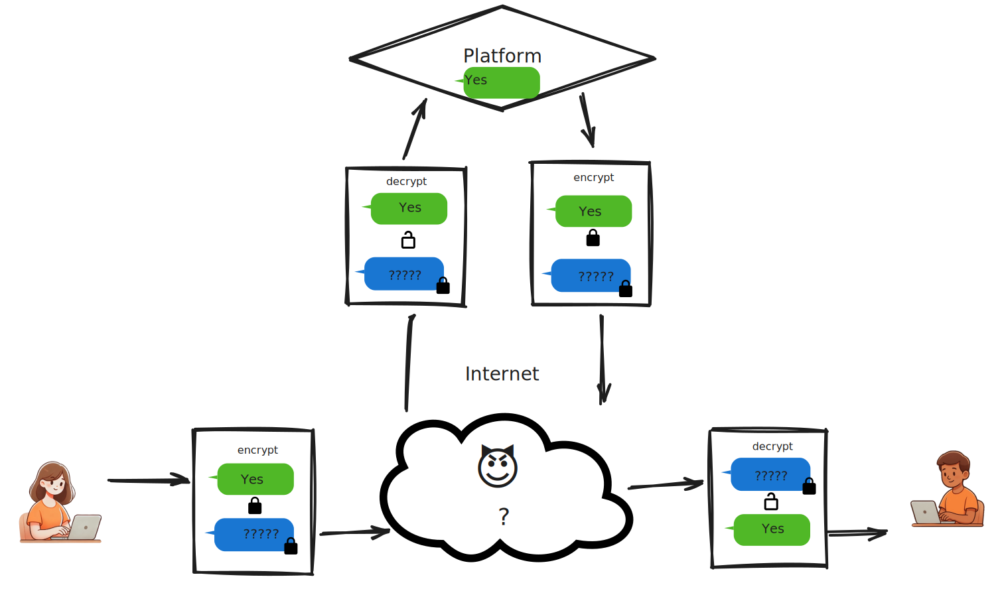

# End-to-end encryption

<!-- introduction -->

Most humans spend more than 40% of their waking life on the internet, using it
for all kinds of tasks—even private ones.

Let's dive into how private internet things really are.

<!-- history -->

## The early internet (web 1.0)

Let's first have a quick look of internet history. At first, the internet was a
friendly place and most communications happened in clear.

But then hackers came, they were able to listen to our communication or even do
powerful tricks such as [man-in-the-middle attacks
(MITM)](https://en.wikipedia.org/wiki/Man-in-the-middle_attack), allowing them
to intercept, block and inject messages, impersoning Alice or Bob. Internet was
no longer a safe place.

But internet was full of wizards. They soon had developed cryptographic
protocols such as [SSH](https://en.wikipedia.org/wiki/Secure_Shell),
[SSL/TLS](https://en.wikipedia.org/wiki/Transport_Layer_Security) and
[PGP](https://en.wikipedia.org/wiki/Pretty_Good_Privacy), allowing them to be
much safer against such attackers.

Everything was fine again.

## The age of platforms (web 2.0)

But then, Muggles (people that did not knew how the internet worked) cames.
Because they were not wizard, they were not able to host their own website
(even more so email servers). Yet they needed to communicate. They had to uses
_platforms_. This is what we call the web 2.0.

Shortly after the rise of the web 2.0, most of our private communications
happens on platforms like Gmail or Whatsapp, most of our though are shared on
Twitter or Reddit, and most of our value is exchanged on platforms such as
Amazon or Uber.

And all of this is fine for a while. Platforms are wonderful, they help people
connect and let the economy grow. They even protect our communication. We hear
Google's ["Don't be evil"](https://en.wikipedia.org/wiki/Don%27t_be_evil) and
there is some "privacy lays" such as the
[GDPR](https://en.wikipedia.org/wiki/General_Data_Protection_Regulation). But
we also entered the world of [Surveillance
capitalism](https://en.wikipedia.org/wiki/Surveillance_capitalism) and [data
brokers](https://en.wikipedia.org/wiki/Data_broker) are everywhere.

## End-to-end encryption

Alice wants to talk to Bob using a platform. Instead of encrypting her message
to the platform, she can encrypt her message to Bob. This is called
**end-to-end encryption**, and it's the way to hide your messages in the age of
the platforms. The idea is simple: you encrypt your messages on _your device_
and the messages are decrypted on your correspondent's device. This way, the
platform only sees the encrypted message, revaling no information about the
cleartext.

## Original version

<!-- encryption -->

Privacy matters. To have privacy on the internet, we usually rely on
encryption. Signal is one of the best tools out there for end-to-end encrypted
communication. Yet encryption is not always enough. We also need to take good
care of metadata.

What is **metadata**? Metadata is the context of your message. From whom to
whom, when, with what device, which app, etc.

Metadata is very important. Some even said that "if you have enough metadata
you don’t really need content". Indeed, knowing who knows who is already
valuable information, and can be enough to infer a lot of information,
including political views or other sensitive information.

Someone sitting in the same coffeeshop, sharing the same wifi hotspot and
looking at network traffic (he is a tech enthusiast) wouldn't be able to know
more than "This person is using Signal (actively or not)". Which you can argue
is already sensitive information, it already tells something about Alice. For
that, you can use a VPN (but they're not silver bullets either).

<!-- Schema SVG de alice, mallory (with a deamon smiley, the wifi hotspot
(internet smileys). You see Signal messages (the arrows become blue with a
signal logo) going through the wifi hotspot, and we can see Mallory seeing them
(also lighting up ?) -->

If you're communicating with someone also sharing the same wifi hotspot, he
would also be able to know "This person is probably communicating with that
person".

<!-- Same schema. But Bob also use Signal, and receive Alice messages (through
the wifi hotspot and back). Mallory can see both, and can infer that Alice is
probably talking to Bob. -->

<!-- weak attacker knowledge

He wouldn't be able to know more than "This person is using Signal actively or
non-actively" (which is already a sensitive information). If you're
communicating with someone also sharing the same wifi hotspot, he would also be
able to know "This person is probably communicating with that person".

This is already a lot. In fact, how often you use Signal says a lot about you,
because it tells a lot about your friends. But for that, we want even more
adoption, so it becomes the norm.

-->

<!-- strong attacker -->

But we also need to consider stronger attackers, including Signal themselve,
the people hosting them (which would be Amazon in the case of Signal), people
owning part of the internet infrastructure, or a even a collusion of such
actors. We consider such powerful attacker in [provable
security](https://en.wikipedia.org/wiki/Provable_security) 

In the case of Signal, Message content's privacy is proven in such strong
model, but for metadata, we don't really know.

Such strong attacker can gain even more information either be passive
observation (I see that when Alice is sending a message, Bob is receiving one).
They can also actively interact to gain some information (If I block Bob, Alice
is not receiving a read receipt).

<!-- Schema with DY attacker -->

Yet, Signal is still an essential tool that we should use as much as possible,
but please remember that it's not a silver bullet. Such metadata gathering
could even transform Signal in the very mass surveillance machinery it tries to
circumvent (the same argument can (loosely) be made for other encrypted
messaging apps like Matrix or (even more strongly) for Telegram, Whatsapp...).

What we really need is [metadata-free
communications](/posts/metadata-free-communications).
